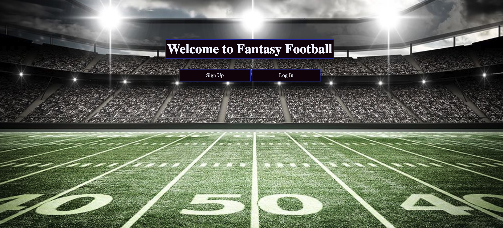
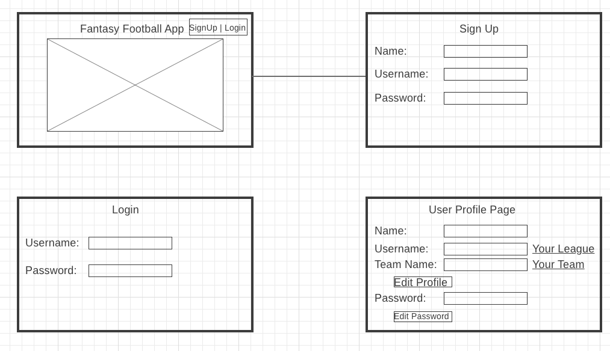
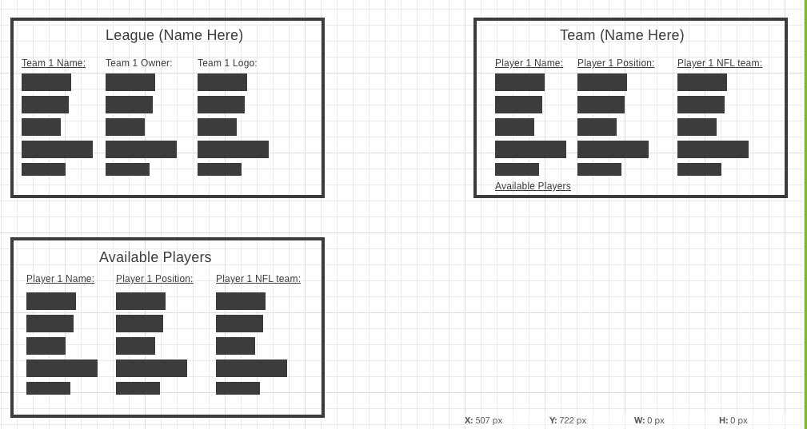
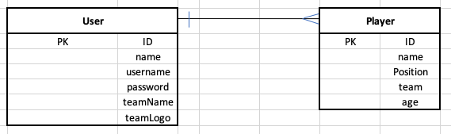

# fantasy-football
1. Title: Fantasy Football

2. Description: 
    1. This project consisted of creating an app with full CRUD functionality. For this project, Brady and I chose to make a fantasy football app. Click the following link to get started on how to play. [Fantasy-Football-Rules](https://fantasy-football-lucas.herokuapp.com/rosters/league/rules) The basic premise behind the app is to create and sign into your profile. From there, you have joined the single league we have created and you can begin building your team. First, directly after you create your user, you can see youre in the profile of the nav bar. Clicking on "Your Roster" will bring you to your roster's page. You can then click on "Your League" to view other rosters in the league. If you would like to add players to your roster, click on "Filter Players" to go to a page where you can search players by their position and/or team or click on "Search Players" if you know the name of the player you'd like to add. 

3. User Stories:
    1. As an unregistered user, I want to be able to sign up with a username and password so that I can join the fantasy football league.
    1. As a registered user, I want to be able to update my username at any time, so that Im not stuck with a username that I spelled wrong.
    1. As a registered user, I want to be able to create my own team, so that I can pick players for my team.
    1. As a new registered user, I want to be able to see a rules page for the league.
    1. As a team owner, I want to be able to update the name of my team at any time, so that I am not stuck with a team name I get tired of.
    1. As a team owner, I want to be able to pick player for my team, so that I can compete against my friends.
    1. As a team owner, I want to be able to drop players from my roster, so I can pick up the next best player.
    1. As a team owner, I want to be able to see the players on my team and their positions.
    1. As a team owner, I want to be able to see the players on each team in my league to see how my team stacks up against them.
    1. As a team owner, I want to be able to see all the players that have not been picked by a team.
    
3. List of Features - MVP (Minimum Viable Product):
    1. User Model to implement full CRUD on user profile ✔
    1. Allow user to signup and login and make it a token so no one can just find the url and jump onto their profile ✔
    1. Players Model to associate a One-Many relationship where One user can have Many players on their team ✔
    1. Allow Users to add/drop players from their team ✔
    1. Allow Users to view other User's teams ✔
    1. Create rules page ✔

4. List of Features - Post-MVP:
    1. Enforcing team position requirements (1QB 2RB 2WR 1TE 1FLEX(RB/WR/TE) 1DST 1K) ✔
    1. Enforce the pesky FLEX position (you can have 3rd RB or WR or 2nd TE if you dont have a FLEX already) ✔
    1. Filter all players by position ✔
    1. Filter all players by team ✔
    1. Search players by name ✔
    1. Trading between teams
    1. Draft format to pick players fairly
    1. Integrating a Player's Stats Model to show new users who was good the previous season

5. Unsolved Problems:
    1. Didnt have time to do proper error handling. Error stays on page until you correctly redo the action that caused the error.
    1. Didnt get csv file seeded into the deployed version, so none of the players show up.

6. List of Technologies Used:
    1. Command Line: Used to navigate file system and organize file structure.
    1. Google Chrome Developer Tools: Used to debug issues in Javascript and also used to see what HTML elements to target when trying to style with CSS.
    1. Visual Studio Code: Used for coding in HTML, CSS, and Javascript.
    1. Wireframe.cc: Used to plan the HTML and CSS portions of the project.
    1. Node.js: Backe-end JS runtime environment..
    1. Postgres: Database used to store data for our User model and Players Model.
    1. Express: Framework used during development.
    1. EJS: Used to embed JS in HTML.

7. Installation:
    1. Google Chrome would be nice since that browser was the one used for debugging

8. Future Next Steps:
    1. Integrate a trade request and accept/decline feature to allow trading players between users.
    1. Integrate a draft format so the first user to create a profile doesnt get the best team.
    1. Integrate a Player Stats Model to allow new users to football to be able to see who was good last year and still pick decent players.

9. Example of Home Page of Website:

10. Wireframe:

11. ERD:

